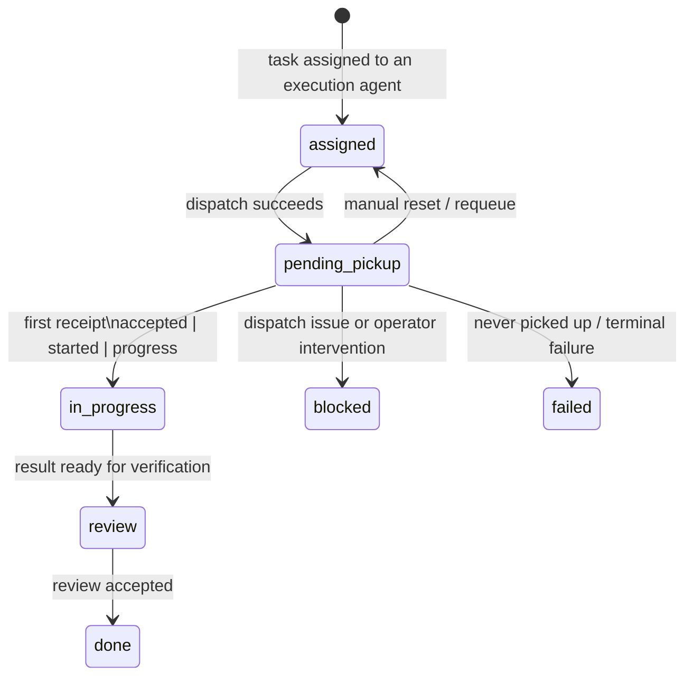

# Taskboard Pending Pickup Lifecycle Walkthrough

## Purpose

`pending-pickup` is the new handoff state between `assigned` and `in-progress` in Mission Control. It exists to make the board honest about what happened after dispatch. Before this change, a task could look active too early. Now the system separates two moments:

1. **Dispatch happened**
2. **The worker actually picked the task up**

That makes operator triage easier. A task in `pending-pickup` has already been dispatched, but the assigned worker has not yet sent its first receipt.

## Operator view

### Pending column on the Taskboard

The taskboard now has a dedicated **Pending** column. In the status presentation layer (`src/lib/task-status-presentation.ts`) this state is rendered as:

- Label: `Pending Pickup`
- Short label: `Pending`
- Icon: `◔`
- Kanban stage: `dispatched`
- Meaning: dispatched and notified, waiting for first worker receipt

This column should be read as: **the system handed the work off, but execution has not been confirmed yet**.

## Lifecycle flow

## What changes at dispatch

When Mission Control dispatches a task, it does **not** mark the task as active immediately. Instead it moves to:

- `status = pending-pickup`
- `dispatchState = dispatched`
- `executionState = queued`

This means the delivery step is complete, but worker execution is still unconfirmed.

## What promotes the task to in-progress

The first non-terminal worker receipt is the pickup signal. Any of these receipts can promote the task:

- `accepted`
- `started`
- `progress`

On that first receipt, the system promotes atomically to:

- `status = in-progress`
- `executionState = active`
- `startedAt = now`

This is the key rule for operators: **Pending means dispatched, In progress means actually picked up**.

## Monitoring and failure interpretation

`worker-monitor.py` treats a task stuck in `pending-pickup` for more than 15 minutes as a likely never-picked-up case. That gives operators a clean signal to investigate worker delivery, routing, or notification issues instead of assuming active execution.

## Screenshot placeholders

1. **Screenshot Placeholder 1:** `Taskboard kanban showing the new Pending column between Ready and In progress.`
2. **Screenshot Placeholder 2:** `Task detail panel showing status=pending-pickup, dispatchState=dispatched, executionState=queued before first receipt.`
3. **Screenshot Placeholder 3:** `Same task after first accepted receipt, now promoted to status=in-progress with executionState=active and startedAt populated.`

## Practical operator checklist

- If a task is in **Ready**, dispatch has not happened yet.
- If a task is in **Pending**, dispatch happened but worker pickup is still waiting.
- If a task is **In progress**, the worker has sent a real pickup signal.
- If **Pending** ages past the expected pickup window, treat it as a handoff problem first, not a work-progress problem.
