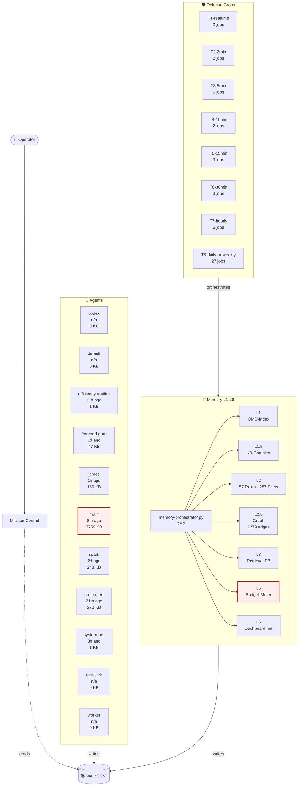

# 🏗️ System Architecture — Live Snapshot

**Generated:** 2026-05-04 18:50 UTC  
**Source-of-Truth:** crontab + rules.jsonl + agents/ + memory/ + vault git-log  
**Refresh-Mode:** auto (drift-resistant) — *no manual update needed*  

## 🗺️ System-Context Diagram



## ⚡ Health Summary

- **Atlas session-size telemetry:** info only — `[2026-04-29T11:15:01Z] CRITICAL session=60585399-c57 pct=208%`
- **Graph edges:** 1279
- **Rules active:** 57
- **Facts (all-time):** 287 across 1 daily files
- **Facts today:** None
- **Scripts (active, no .bak):** 133 root + 72 workspace = 205
- **Cron entries (live):** 51

## 🤖 Agents (11)

| ID | Last Session | Latest Size (KB) | Path |
|----|--------------|------------------|------|
| `codex` | n/a | 0 | `/home/piet/.openclaw/agents/codex` |
| `default` | n/a | 0 | `/home/piet/.openclaw/agents/default` |
| `efficiency-auditor` | 11h ago | 1 | `/home/piet/.openclaw/agents/efficiency-auditor` |
| `frontend-guru` | 1d ago | 47 | `/home/piet/.openclaw/agents/frontend-guru` |
| `james` | 1h ago | 166 | `/home/piet/.openclaw/agents/james` |
| `main` | 8m ago | 3759 | `/home/piet/.openclaw/agents/main` |
| `spark` | 2d ago | 248 | `/home/piet/.openclaw/agents/spark` |
| `sre-expert` | 21m ago | 270 | `/home/piet/.openclaw/agents/sre-expert` |
| `system-bot` | 8h ago | 1 | `/home/piet/.openclaw/agents/system-bot` |
| `test-lock` | n/a | 0 | `/home/piet/.openclaw/agents/test-lock` |
| `worker` | n/a | 0 | `/home/piet/.openclaw/agents/worker` |

## 🛡️ Defense-Crons (51 active, by tier)

### T1-realtime (2 jobs)

| Schedule | Script |
|---|---|
| `* * * * *` | `$OPENCLAW/scripts/openclaw-config-guard.sh` |
| `* * * * *` | `$OPENCLAW/scripts/crontab-schema-gate.sh` |

### T2-2min (2 jobs)

| Schedule | Script |
|---|---|
| `*/2 * * * *` | `/usr/bin/flock` |
| `*/2 * * * *` | `$OPENCLAW/workspace/scripts/state-collector.py` |

### T3-5min (6 jobs)

| Schedule | Script |
|---|---|
| `*/5 * * * *` | `$OPENCLAW/scripts/cost-alert-dispatcher.py` |
| `*/5 * * * *` | `$OPENCLAW/scripts/mc-critical-alert.py` |
| `*/5 * * * *` | `$OPENCLAW/scripts/memory-budget-meter.sh` |
| `*/5 * * * *` | `$OPENCLAW/scripts/session-size-guard.py` |
| `*/5 * * * *` | `$OPENCLAW/scripts/mcp-taskboard-reaper.sh` |
| `*/5 * * * *` | `$OPENCLAW/scripts/session-rotation-watchdog.py` |

### T4-10min (2 jobs)

| Schedule | Script |
|---|---|
| `*/10 * * * *` | `$OPENCLAW/scripts/atlas-orphan-detect.sh` |
| `*/10 * * * *` | `$OPENCLAW/scripts/session-health-monitor.py` |

### T5-15min (3 jobs)

| Schedule | Script |
|---|---|
| `*/15 * * * *` | `$OPENCLAW/scripts/self-optimizer.py` |
| `*/15 * * * *` | `$OPENCLAW/scripts/trajectory-hygiene.py` |
| `*/15 * * * *` | `$OPENCLAW/scripts/cron-runs-tracker.py` |

### T6-30min (3 jobs)

| Schedule | Script |
|---|---|
| `23,53 * * * *` | `$OPENCLAW/scripts/session-size-alert.sh` |
| `*/30 * * * *` | `flock` |
| `15,45 * * * *` | `$OPENCLAW/scripts/qmd-native-embed-cron.sh` |

### T7-hourly (6 jobs)

| Schedule | Script |
|---|---|
| `0 */1 * * *` | `$OPENCLAW/scripts/r48-board-hygiene-cron.sh` |
| `30 * * * *` | `$OPENCLAW/workspace/scripts/memory-orchestrator.py` |
| `0 * * * *` | `$OPENCLAW/workspace/scripts/mc-ops-monitor.sh` |
| `0 * * * *` | `$OPENCLAW/scripts/rules-render.sh` |
| `5 * * * *` | `$OPENCLAW/scripts/qmd-pending-monitor.sh` |
| `23 * * * *` | `$OPENCLAW/scripts/minions-pr-watch.sh` |

### T8-daily-or-weekly (27 jobs)

| Schedule | Script |
|---|---|
| `1-59/5 * * * *` | `$OPENCLAW/scripts/sprint-debrief-watch.sh` |
| `5-59/15 * * * *` | `$OPENCLAW/scripts/r49-claim-validator.py` |
| `45 2 * * *` | `$OPENCLAW/workspace/scripts/memory-orchestrator.py` |
| `0 5 * * 0` | `$OPENCLAW/workspace/scripts/memory-orchestrator.py` |
| `0 4 1 */3 *` | `$OPENCLAW/workspace/scripts/memory-orchestrator.py` |
| `7 */6 * * *` | `$OPENCLAW/scripts/memory-size-guard.sh` |
| `0 */6 * * *` | `$OPENCLAW/scripts/script-integrity-check.sh` |
| `0 */6 * * *` | `flock` |
| `5-59/30 * * * *` | `$OPENCLAW/scripts/pr68846-patch-check.sh` |
| `0 3 * * *` | `$OPENCLAW/scripts/cleanup.sh` |
| `0 3 * * *` | `$OPENCLAW/scripts/config-snapshot-to-vault.sh` |
| `0 3 * * 0` | `$OPENCLAW/scripts/build-artifact-cleanup.sh` |
| `10-59/30 * * * *` | `$OPENCLAW/scripts/cron-health-audit.sh` |
| `0 */6 * * *` | `$OPENCLAW/scripts/alert-dispatcher.sh` |
| `15-59/30 * * * *` | `$OPENCLAW/scripts/session-janitor.py` |
| `2-59/5 * * * *` | `$OPENCLAW/scripts/cpu-runaway-guard.sh` |
| `0 6 * * *` | `$OPENCLAW/workspace/scripts/agents-md-size-check.sh` |
| `3-59/5 * * * *` | `$OPENCLAW/scripts/session-size-guard.py` |
| `4-59/5 * * * *` | `$OPENCLAW/scripts/mcp-qmd-reaper.sh` |
| `0 8 * * *` | `$OPENCLAW/scripts/vault-search-daily-checkpoint.sh` |
| `1-59/5 * * * *` | `$OPENCLAW/scripts/per-tool-byte-meter.py` |
| `20-59/30 * * * *` | `$OPENCLAW/workspace/scripts/architecture-snapshot-generator.py` |
| `2-59/5 * * * *` | `$OPENCLAW/scripts/arch-deploy-readiness-check.sh` |
| `05 21 * * *` | `$OPENCLAW/scripts/daily-ops-digest.py` |
| `3-59/5 * * * *` | `$OPENCLAW/scripts/gateway-memory-monitor.py` |
| `10-59/15 * * * *` | `$OPENCLAW/scripts/billing-alert-watch.sh` |
| `30 */6 * * *` | `$OPENCLAW/scripts/vault-frontmatter-validator.py` |

## 🧠 Memory Layers (L1-L6)

| Layer | Component | Status |
|---|---|---|
| L1 | QMD Hybrid-Retrieval | indexed via `qmd update` */30 |
| L1.5 | KB-Compiler | nightly via memory-orchestrator |
| L2 | Rules + Facts | 57 rules · 287 facts |
| L2.5 | Graph-Edge-Builder | 1279 edges |
| L3 | Retrieval-Feedback-Loop | hourly |
| L5 | Memory-Budget-Meter | */5 — see tail below |
| L6-Lite | Memory Dashboard | nightly 04:30 UTC |

**Last 5 budget-meter ticks:**
```
[2026-04-29T10:55:01Z] OK session=019dd260-df1 pct=6%
[2026-04-29T11:00:01Z] CRITICAL session=60585399-c57 pct=193%
[2026-04-29T11:05:01Z] OK session=019dd260-df1 pct=29%
[2026-04-29T11:10:01Z] CRITICAL session=60585399-c57 pct=197%
[2026-04-29T11:15:01Z] CRITICAL session=60585399-c57 pct=208%
```

## 📜 Rules R1-R57 (56 total, by category)

### API-Regeln (3)
- ✅ **R1** — Verify-After-Write ist Pflicht
- ✅ **R2** — Kein unreplaced `{placeholder}` in Task-Description
- ✅ **R3** — Atlas meldet keinen Erfolg ohne GET-Verify

### Agent-Targeting-Regeln (2)
- ✅ **R11** — Runtime-ID vs Alias nicht verwechseln
- ✅ **R12** — Worker-Agents dürfen kein LTM schreiben

### Atlas-Governance (4)
- ✅ **R49** — Atlas Anti-Hallucination Claim-Verify-Before-Report
- ✅ **R54** — MCP-Not-Connected erst als Session-/Gateway-Korrelation triagieren
- ✅ **R55** — Gateway-Restart heilt keine stale MCP-Session-Runtimes
- ✅ **R57** — Atlas terminal results use canonical Stage-7 format

### Board-Hygiene (1)
- 🔵 **R48** — Board-Hygiene-Cron auto-cancel stale drafts

### Build & Code-Safety (3)
- 🔵 **R26** — Server-Only Import-Disziplin
- 🔵 **R27** — Legacy-Task nach Root-Cause-Fix
- ✅ **R28** — Operator-Lock-Respekt (geplant, Phase 2 Stabilization-Plan)

### Build / Deploy-Regeln (2)
- ✅ **R7** — Kanonische Build-Sequenz (nicht `deploy.sh`)
- ✅ **R8** — Jeder Edit bekommt `.bak-<scope>-<datum>`

### Build-Deploy-Regeln (17)
- ✅ **R29** — Build-Storm-Debounce
- 🟡 **R30** — MCP-Taskboard-Server-Zombies
- 🟡 **R31** — API-Ghost-State (List vs Get divergiert)
- 🟡 **R32** — Dispatch-Gate Atlas-Sonderfall
- ✅ **R33** — Cron-Script-Pfad-Integrität
- 🔵 **R34** — Bootstrap-Limit für MEMORY.md (Agent-Bootstrap-Truncation)
- ✅ **R35** — Atlas-Self-Report ≠ Board-Truth
- 🟡 **R36** — Agent-Session-File-Size-Creep
- 🔵 **R37** — Atlas-Orchestrator-Tasks nicht via Auto-Pickup
- 🔵 **R38** — MCP-Zombie-Defense-in-depth (existierender Reaper + Alert)
- ✅ **R39** — Atlas-main braucht Session-Resume-Pattern
- 🔵 **R40** — Stall-Detection-Thresholds sind Kern-Infra
- ✅ **R41** — Memory-Retrieval: QMD vor File-Read
- ✅ **R46** — Parallel-Deploy-Serialization
- ✅ **R50** — Session-Lock-Governance fuer Auto-Pickup
- ✅ **R42** — Deploy-Restart-Discipline via mc-restart-safe
- ✅ **R52** — Auto-Pickup Silent-Fail-Detection

### Codex-Governance (1)
- ✅ **R56** — Vault-SSOT und Sprint-Read-Order respektieren

### Config-Regeln (4)
- ✅ **R4** — openclaw.json NIE direkt editieren
- ✅ **R5** — Kanonischer MC-Service ist User-Level, Port 3000
- ✅ **R6** — `worker-pickup-loop.py` bleibt tot
- ✅ **R51** — Schema-Validation-Gate fuer openclaw.json

### Governance (1)
- ✅ **R47** — Scope-Lock-auf-Plan-Doc nicht Task-ID

### Hygiene (1)
- ✅ **R53** — Config/Scripts Daily Snapshot in Vault

### Integrations-Regeln (2)
- 🔵 **R9** — Discord-Webhook-Calls brauchen User-Agent
- ✅ **R10** — Alerts laufen NICHT über MC-API

### Multi-Agent-Koordinations-Regeln (6)
- ✅ **R18** — mc-ops-monitor ist read-only-alerting
- ✅ **R19** — heartbeat darf keinen Subagent spawnen für terminale Tasks
- ✅ **R20** — worker-monitor ist run-lifecycle-only
- ✅ **R21** — Layer-Cleanup-Tasks brauchen Script-Referenz-Check
- 🔵 **R22** — Task ohne Result-Receipt ≠ erfolgsfrei
- ✅ **R23** — Retry-Task nur bei Parent in failed/error-State

### Multi-Agent-Orchestration (2)
- ✅ **R45** — Sub-Agent-Receipt-Discipline
- ✅ **R44** — Board-Discipline: Board-Task required before sessions_spawn

### Naming & Runtime-Regeln (2)
- 🔵 **R24** — Runtime-ID vs Display-Alias Disziplin (verschärft)
- 🔵 **R25** — workerLabel muss beim Dispatch gesetzt werden

### Operator-Eingriff-Regeln (5)
- ✅ **R13** — Operator greift bei Instabilität ein, nicht bei langsamkeit
- ✅ **R14** — Tangenten → `spawn_task`, nie mitnehmen
- ✅ **R15** — Deploy-Sequenz ist atomar im Agent-Turn
- ✅ **R16** — V8-Heap-Limit muss explizit sein
- ✅ **R17** — systemd MemoryMax > V8 Heap-Limit

## 📚 Recent Vault Commits

```
32e235d 2026-05-04 auto-sync: 2026-05-04 20:40
5d9fc3b 2026-05-04 docs(hermes): define atlas read-only review lane
31babca 2026-05-04 auto-sync: 2026-05-04 20:09
bd7ef32 2026-05-04 auto-sync: 2026-05-04 19:39
37094a0 2026-05-04 auto-sync: 2026-05-04 19:08
```

---

*This document regenerates automatically. To regenerate manually:*  
`python3 /home/piet/.openclaw/workspace/scripts/architecture-snapshot-generator.py`
