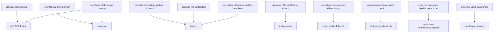

# Forge Scheduler Graph Audit — 2026-04-19

## Scope
Audit aller 4 Scheduler-Typen in Sprint-F/F2:
- crontab-user
- systemd-user-timer
- openclaw-cron-plugin
- HEARTBEAT-driven

## Inventory Summary
- Total Jobs: **65**
- By Scheduler: {'crontab-user': 24, 'systemd-user-timer': 6, 'openclaw-cron-plugin': 24, 'heartbeat-driven': 11}
- By Status: {'active': 47, 'broken': 10, 'disabled': 8}
- By Risk: {'high': 35, 'medium': 12, 'low': 18}

## Verification
- 4 Scheduler-Typen enthalten: **yes**
- JSONL Zeilen: **65** (target >= 50)
- High-Risk Jobs: **35** (target >= 3)

## Top High-Risk Lifecycle Jobs (sample)
- [crontab-user] `/home/piet/.openclaw/scripts/cleanup.sh` | status=active | alerts=none/implicit
- [crontab-user] `flock -n /tmp/mc-auto-pickup.lock /home/piet/.openclaw/scripts/auto-pi` | status=active | alerts=discord-channel/1491148986109661334
- [crontab-user] `flock -n /tmp/mc-watchdog.lock /home/piet/.openclaw/scripts/mc-watchdo` | status=active | alerts=discord-webhook(MC_WATCHDOG_WEBHOOK_URL)
- [crontab-user] `flock -n /tmp/mc-cost-alert-dispatcher.lock /home/piet/.openclaw/scrip` | status=active | alerts=none/implicit
- [crontab-user] `flock -n /tmp/mc-critical-alert.lock /home/piet/.openclaw/scripts/mc-c` | status=active | alerts=none/implicit
- [crontab-user] `/home/piet/.openclaw/bin/openclaw sessions cleanup --all-agents --enfo` | status=active | alerts=none/implicit
- [crontab-user] `flock -n /tmp/build-artifact-cleanup.lock /home/piet/.openclaw/scripts` | status=active | alerts=none/implicit
- [systemd-user-timer] `unknown` | status=broken | alerts=none/implicit

## Dependency Highlights
- `auto-pickup.py` und HEARTBEAT stale-cleanup berühren beide Task-Lifecycle, Race-Risk bei inkonsistenten runs.json-States.
- `mc-watchdog.sh`, `mc-critical-alert.py`, `session-freeze-watcher.sh`, heartbeat-death-check bilden redundante Alert-Kette Richtung `#alerts`.
- OpenClaw-Cron Jobs mit `sessionTarget=isolated` hängen stark von Agent/session health ab (Zombie/timeout risk).
- Mehrere Stabilization-Mode-Blöcke in HEARTBEAT sind derzeit `disabled` → bewusstes Risiko: kein Auto-Respawn.

## Mermaid Draft (Top dependency graph)

## Risks / Constraints
1. `systemd-user-timer` hat aktuell mehrere `failed` states (forge-heartbeat, lens-cost-check, openclaw-healthcheck, researcher-run).
2. `Sprint-Debrief-Watch` im openclaw-cron-plugin zeigt `consecutiveErrors=26` (persistent broken schedule).
3. Heartbeat-Flow hat mehrere kritische Pfade explizit deaktiviert (Stabilization Mode), dadurch manuelle Operations-Last höher.
4. Hohe Alert-Dichte auf `#alerts`, Gefahr von Alert-Fatigue ohne dedupe/cooldown across schedulers.

## Artifacts
- JSONL: `/home/piet/.openclaw/workspace/memory/ops-schedulers-audit.jsonl`
- Source snapshots: `crontab -l`, `systemctl --user list-timers`, `/home/piet/.openclaw/cron/jobs.json`, `HEARTBEAT.md`
